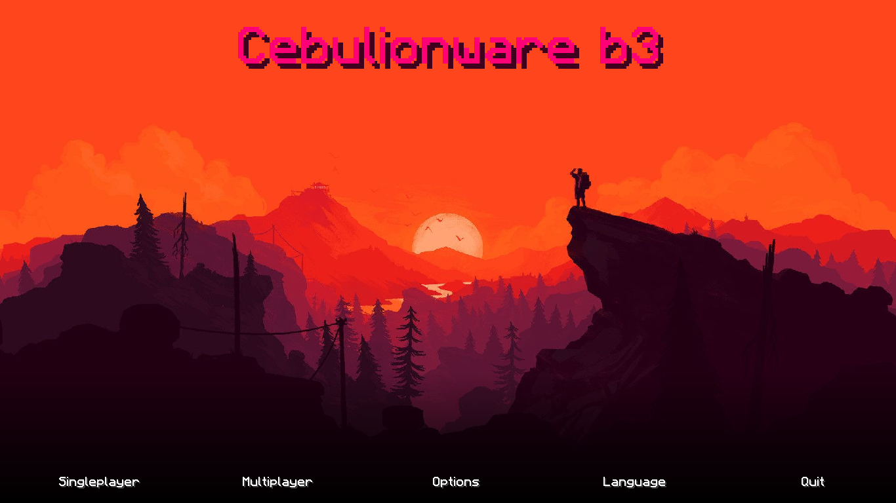

# cebulionware

Minecraft 1.8-1.8.9 Hacked Client
(Work in progress)

## how to install
* click on the latest file (DO NOT CLONE THE WHOLE REPO), and click download
* move the zip into %appdata%/.minecraft/.versions/
* unpack the zip here using the standard windows zip tool
* add the version to your installations list in the launcher

NOTE: b1, b2 and b3 require java 11 to run, if you run it with java 8 you'll only get errors, so install java 11 (and select the right executable in the installation properties) or wait for the next release, which will require java 8.

## Features
* HUD (module list)
* TabGUI (Cheat menu)
* Fly (Fly like a bird)
* Sprint (Auto sprinting)
* Sneak (Sneak all the time like you want to shit hard)
* Light (You won't see the darkness anymore)
* NoFall (No fall damage)
* Killaura (Attacks enemies around you)
* Mobaura (Killaura, but attacks hostile mobs)
* Criticals (Deal more damage \[minijumps])
* AntiKnockback (when someone hit, you don't go flying brr)
* Ice (Increased clientsided block slipperiness)
* BunnyHop (Run'n'Jump faster)
* Jesus (Walk on liquids)
* Derp (Visible only to other players, random body, head and hand movement)
* Panic (Turns off all modules, except the TabGUI)
* Headless (Only visible to other players, your head is in your body)
* Step (Immidiately climb blocks \[max 2])
* Spider (Climb vertical walls like ladders)
* Timer (Makes the time on your side go brr \[2x])
* Insaneaura (Higher reach than Killaura)
* ChatSpam (spams the chat with the client's name)
* Reach (LOOOOONG hand, 4.5 -> 6)
* Custom Main Menu
* TMR™ (Too Much RGB)
* AutoEZ in Killaura
* Enemy stats in Killaura (coords, health, name)
